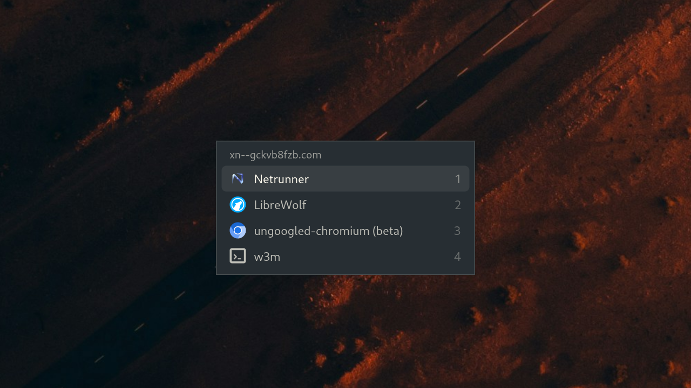

# Browser Select

[](https://xn--gckvb8fzb.com/segv/)



Choose between browsers when opening links.

[](https://xn--gckvb8fzb.com/contact/)

_Browser Select_ lets you pick the browser a link opens in, at the moment you
click it.

It registers itself as a web browser, hence every link another application opens
goes to it first. A small popup lists the browsers installed on the system, and
you pick one with the mouse or the keyboard.

## Installation

_Browser Select_ is built from source. It needs Zig 0.16 or newer and the GTK4,
GLib and Wayland development files:

| System  | Packages                                        |
| ------- | ----------------------------------------------- |
| Fedora  | `gtk4-devel glib2-devel wayland-devel`          |
| Debian  | `libgtk-4-dev libglib2.0-dev libwayland-dev`    |
| Arch    | `gtk4 glib2 wayland`                            |
| Alpine  | `gtk4.0-dev glib-dev wayland-dev`               |
| Gentoo  | `gui-libs/gtk:4 dev-libs/glib dev-libs/wayland` |
| Void    | `gtk4-devel glib-devel wayland-devel`           |
| FreeBSD | `gtk4 glib wayland`                             |
| OpenBSD | `gtk+4 glib2 wayland`                           |
| NetBSD  | `gtk4 glib2 wayland`                            |

```sh
zig build -Doptimize=ReleaseSafe --prefix ~/.local
```

That writes `~/.local/bin/browserselect` and
`~/.local/share/applications/browserselect.desktop`. Set `--prefix /usr/local`
for a system wide install instead.

To make it the default browser use the following commands:

```sh
update-desktop-database ~/.local/share/applications
xdg-settings set default-web-browser browserselect.desktop
```

If the `set default-web-browser` command returns something along the lines of
`xdg-settings: $BROWSER is set and can't be changed with xdg-settings` then you
can still set _Browser Select_ for individual schemes and mimes:

```sh
xdg-mime default browserselect.desktop x-scheme-handler/http
xdg-mime default browserselect.desktop x-scheme-handler/https
xdg-mime default browserselect.desktop text/html
```

## Usage

Clicking a link anywhere should bring up _Browser Select_. Move through it with
the arrow keys and open the selected browser with _Return_. You can also press
_1_ to _9_ to open that entry straight away, or simply click it with the mouse.

The _Escape_ key closes the popup without opening anything. Clicking elsewhere
and letting the popup lose focus does the same.

You can also call _Browser Select_ manually using:

```sh
browserselect https://xn--gckvb8fzb.com
```

If you call it without an address the picked browser is started on its own. If
you enable caching in the config then _Browser Select_ will remember the choice
for the amount of time specified by `timeout` and won't ask you again when you
click another link, and simply open the link in the previously selected browser.

## Configuration

Configuration is optional and read from
`$XDG_CONFIG_HOME/browserselect/config.toml`, or from
`$HOME/.config/browserselect/config.toml` when `XDG_CONFIG_HOME` is unset.
[`config.example.toml`][example] shows how to configure it.

The window can be made translucent if you would want it to be using the `[menu]`
option `opacity` (values from `0.1` to `1.0`). Compositors that implement the
`ext-background-effect-v1` protocol, such as KWin 6.7, Hyprland 0.56, niri
26.04, Mutter 51 and COSMIC, additionally blur the background behind it as well
because it seems like glass-like aesthetics are big these days. For example
Sway, however, has no blur, but it can be simulated using `static_blur = true`
under `[menu]`, which makes _Browser Select_ draw a blurred picture of the
screen behind the window instead. Obviously if the background behind _Browser
Select_ is something that changes (e.g. video) this workaround won't work, but
for your average `r/unixporn` post it should be fairly sufficient.

[example]: config.example.toml

## License

Copyright © 2026 [マリウス](https://xn--gckvb8fzb.com)

_Browser Select_ is released under Version 1.1 of the
[SEGV License](https://xn--gckvb8fzb.com/segv/), whose full text is included in
the [LICENSE](LICENSE) file. Go read it, there will be a test on it on Monday.
